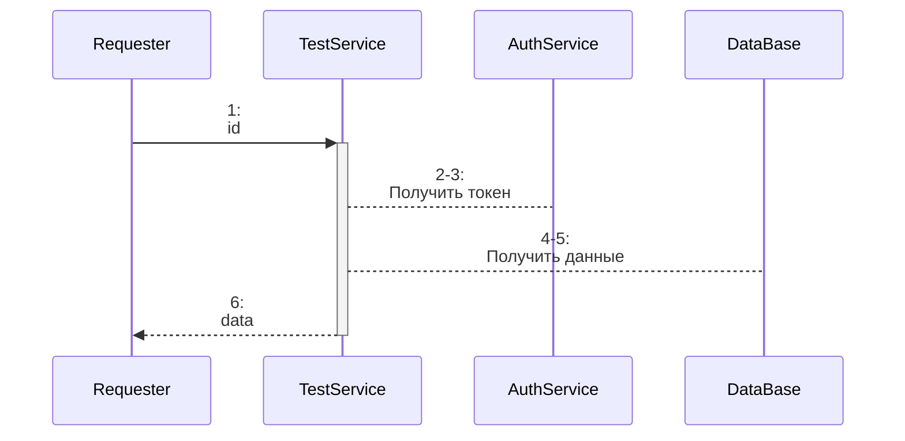

# Техзадание: TestService
| Дата | Версия | Автор |
| - | - | - |
| 28.01.2021 | v.1.0.0 | Амантаев А.А. |

## Назначение
Получение и возврат данных от DataBase

## Требования
- Заведены конфигурационные данные
    | serviceId | secret |
    | - | - |
    | AuthService | ***** |
    | DataBase | ***** |
- Хранить логи в течение 3-х месяцев

## Методы
| Название | Описание |
| - | - |
| [retrieveData](#retrieveData) | Получение данных |

---

<div id="retrieveData"></div>

## retrieveData

### Схема основного потока



### Порядок обмена данными

| # | параметры |  | участник |  | формат |  |
| - | - | - | - | - | - | - |
| [1](#retrieveData1) | id | от | Requester | запросом | HTTP GET | принять |
| 2 | id | в | AuthService | запросом | HTTP POST | отдать |
| 3 | token | от | AuthService | ответом | JSON | принять |
| 4 | id <br/> token | в | DataBase | запросом | XML | отдать |
| 5 | data | от | DataBase | ответом | Data Set | принять |
| 6 | data | в | Requester | ответом | JSON | отдать |

### Основной поток

#### **Триггер**

<div id="retrieveData1"></div>

***1 - запрос принять***

HTTP GET /retrieveData?id=12345
```json

```

| параметр | тип | длина | обязательный | коммент |
| - | - | - | - | - |
| id | Number | 5 | Y | Идентификатор данных |

a. Извлечь значение
- Идентификатор данных: id

b. Валидировать regex:
- Идентификатор данных: ^\d{5}$

---

#### **Результат**

***6 - ответ отдать***

JSON
```json
{
    "data": [
        {"1": "blablabla"},
        {"2": "blablabla"},
        {"3": "blablabla"}
    ]
}
```

| параметр | тип | длина | обязательный | коммент |
| - | - | - | - | - |
| data | Array |  | Y | Данные |

a. Вернуть
- Requester

### Поток отказоустойчивости (ошибочный)

| Ссылка на шаг | Сценарий ошибки | Алгоритм обработки | Пример формата ответа |
| - | - | - | - |
| [1.a](#retrieveData1) | Отсутствует либо пустое значение id | - логировать ошибку; </br>- возвратить код и описание ошибки; </br>- завершить процесс. | HTTP STATUS CODE 400 </br>{</br>"status":"error", </br>"description":"invalid input: id" </br>} |
